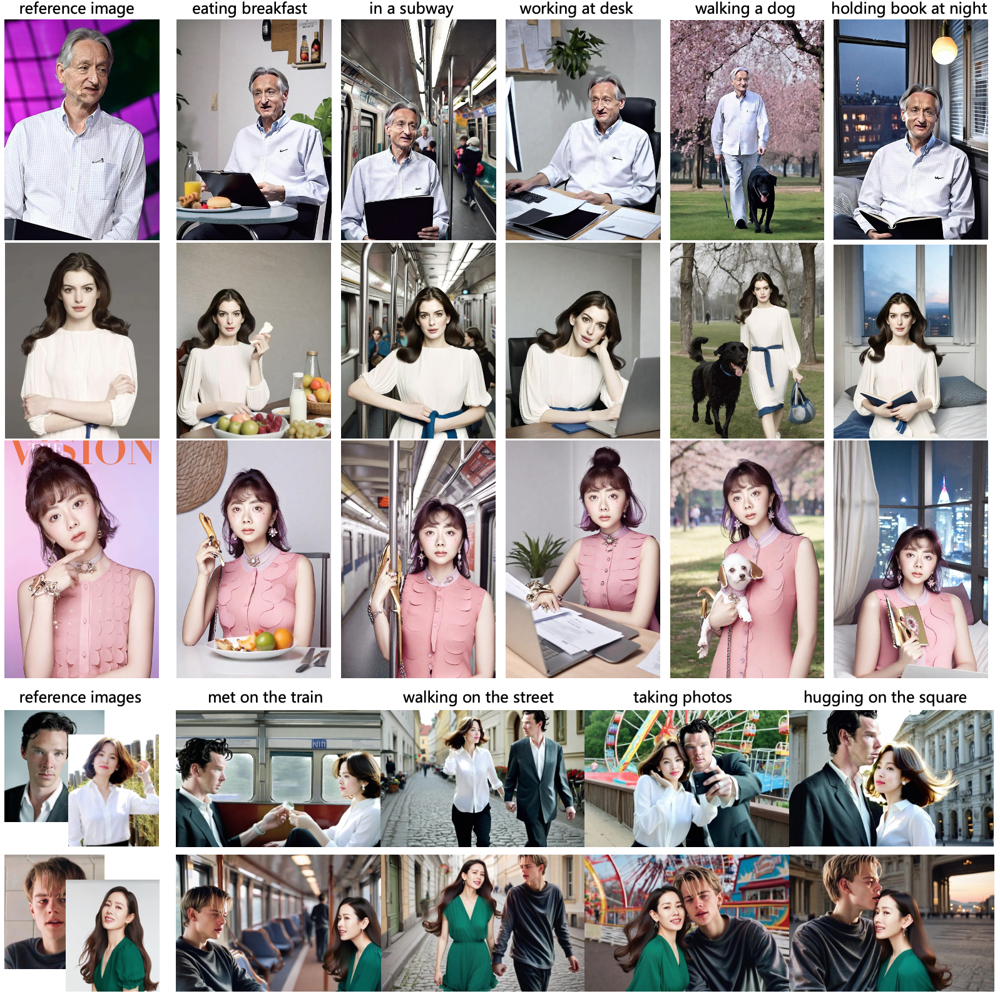
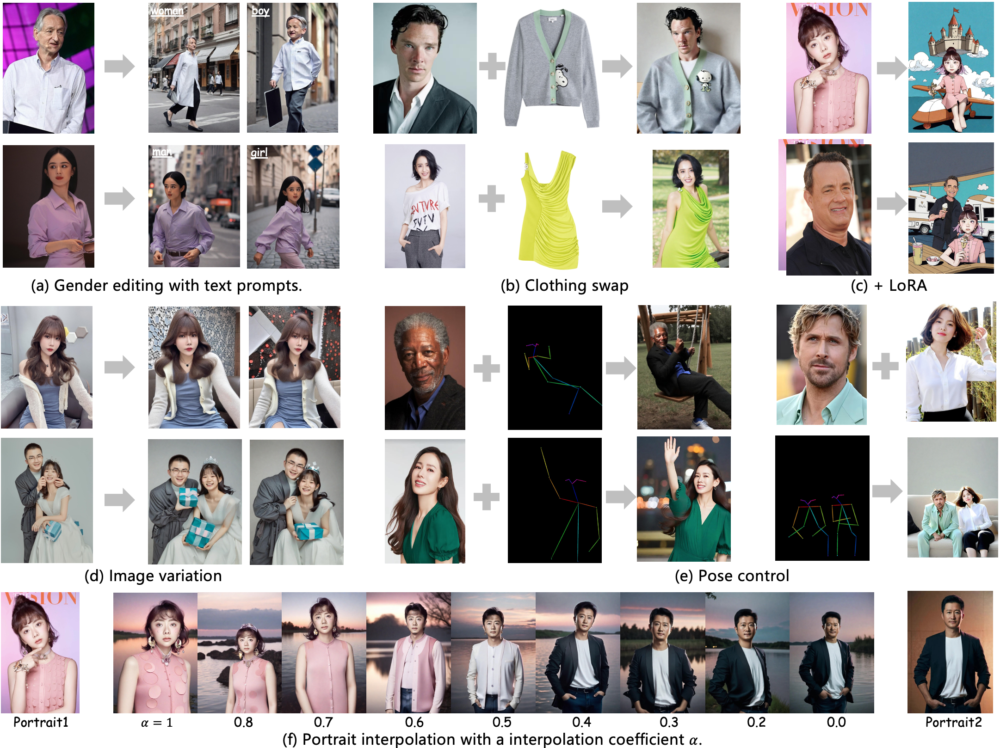

<div align="center">
<h1>StoryMaker</h1>

</div>


## Demos

### Single Portrait Synthesis

<p align="center">
  
</p>

### Two Portrait Synthesis

<p align="center">
  
</p>

### Diverse application

<p align="center">
  
</p>

## Download

You can directly download the model from [Huggingface](https://huggingface.co/RED-AIGC/StoryMaker).

If you cannot access to Huggingface, you can use [hf-mirror](https://hf-mirror.com/) to download models.
```python
export HF_ENDPOINT=https://hf-mirror.com
huggingface-cli download --resume-download RED-AIGC/StoryMaker --local-dir checkpoints --local-dir-use-symlinks False
```

For face encoder, you need to manually download via this [URL](https://github.com/deepinsight/insightface/issues/1896#issuecomment-1023867304) to `models/buffalo_l` as the default link is invalid. Once you have prepared all models, the folder tree should be like:

```
  .
  ├── models
  ├── checkpoints/mask.bin
  ├── pipeline_sdxl_storymaker.py
  └── README.md
```

## Usage

```python
# !pip install opencv-python transformers accelerate insightface
import diffusers

import cv2
import torch
import numpy as np
from PIL import Image

from insightface.app import FaceAnalysis
from pipeline_sdxl_storymaker import StableDiffusionXLStoryMakerPipeline

# prepare 'buffalo_l' under ./models
app = FaceAnalysis(name='buffalo_l', root='./', providers=['CUDAExecutionProvider', 'CPUExecutionProvider'])
app.prepare(ctx_id=0, det_size=(640, 640))

# prepare models under ./checkpoints
face_adapter = f'./checkpoints/mask.bin'

base_model = 'huaquan/YamerMIX_v11'  # from https://civitai.com/models/84040?modelVersionId=309729
pipe = StableDiffusionXLStoryMakerPipeline.from_pretrained(
    base_model,
    torch_dtype=torch.float16
)
pipe.cuda()

# load adapter
pipe.load_storymaker_adapter(image_encoder_path, face_adapter, scale=0.8, lora_scale=0.8)
pipe.scheduler = UniPCMultistepScheduler.from_config(pipe.scheduler.config)
```

Then, you can customized your own images

```python
# load an image and mask
face_image = Image.open("examples/ldh.png").convert('RGB')
mask_image = Image.open("examples/ldh_mask.png").convert('RGB')
    
face_info = app.get(cv2.cvtColor(np.array(image), cv2.COLOR_RGB2BGR))
face_info = sorted(face_info, key=lambda x:(x['bbox'][2]-x['bbox'][0])*(x['bbox'][3]-x['bbox'][1]))[-1] # only use the maximum face

prompt = "a person is taking a selfie, the person is wearing a red hat, and a volcano is in the distance"
n_prompt = "bad quality, NSFW, low quality, ugly, disfigured, deformed"

generator = torch.Generator(device='cuda').manual_seed(666)
for i in range(4):
    output = pipe(
        image=image, mask_image=mask_image, face_info=face_info,
        prompt=prompt,
        negative_prompt=n_prompt,
        ip_adapter_scale=0.8, lora_scale=0.8,
        num_inference_steps=25,
        guidance_scale=7.5,
        height=1280, width=960,
        generator=generator,
    ).images[0]
    output.save(f'examples/results/ldh666_new_{i}.jpg')
```


## Acknowledgements
- Our work is highly inspired by [IP-Adapter](https://github.com/tencent-ailab/IP-Adapter) and [InstantID](https://github.com/instantX-research/InstantID). Thanks for their great works!
- Thanks [Yamer](https://civitai.com/user/Yamer) for developing [YamerMIX](https://civitai.com/models/84040?modelVersionId=309729), we use it as base model in our demo.
